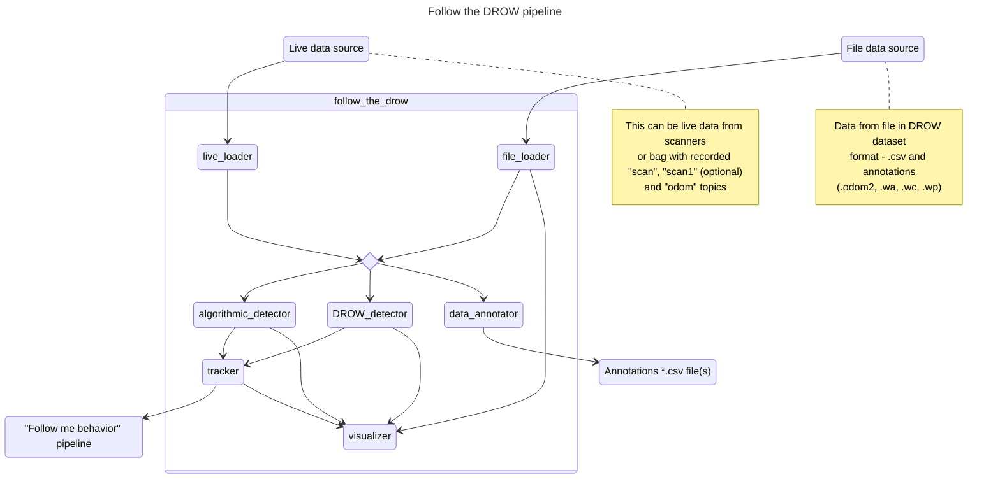

# Follow the DROW

A research framework for person detection on knee-height 2D LiDAR data, benchmarking neural-network and rule-based detectors across three public datasets and deploying the full pipeline on a mobile robot.

The project evaluates the published [DROW (ICRA 2016 / IROS 2018)](https://arxiv.org/abs/1804.02463) and [DR-SPAAM (RA-L 2022)](https://arxiv.org/abs/2004.14064) detectors alongside two ONNX baselines ([LFE-Peaks / LFE-PPN, Amodeo et al. 2025](https://arxiv.org/abs/2306.08531)), a C++ rule-based detector, and three novel full-scan architectures introduced here: **FullScanCNN**, **SpaceTimeCNN**, and **FullScanTransformer**. A central finding is that DROW's benchmark scores are substantially limited by annotation quality issues in the original dataset; the denser FROG dataset closes this gap and reveals the true capability of learned detectors.

## Contents of the repository

This repository consists of several parts:

1. **Library** — Python and C++ library of nine detector implementations, three dataset loaders, and preprocessing utilities.
2. **ROS system** — ROS Noetic nodes for real-time data ingestion, detection, single-target tracking, visualisation, and dataset annotation, deployable in Docker on a laptop or directly on the robot.
3. **Research utilities** — unified training, evaluation, hyperparameter tuning, and video-rendering scripts covering all detector types across three datasets.
4. **Notebooks** — interactive exploration of detector behaviour, architecture comparisons, and dataset properties.

## Research Contributions

- **Annotation quality analysis** — the DROW training set carries sparse ground-truth labels (valid annotations cover only ~20 s out of each 3-minute sequence), introducing systematic false-negative label noise that explains a large share of the observed performance deficit of neural detectors vs. the algorithmic baseline on the DROW benchmark.
- **Novel full-scan architectures** — three new detectors that replace the fixed-size cutout with whole-scan input and a richer `(r, x, y)` coordinate representation: **FullScanCNNDetector** (dilated 1D CNN + GRU), **SpaceTimeCNNDetector** (2D space-time convolution), and **FullScanTransformerDetector** (dilated CNN + global beam self-attention).
- **FROG and JRDB dataset support** — loaders for the FROG dataset (720-beam, dense per-frame annotations, specifically designed to address DROW's annotation limitations) and the JRDB dataset (541-beam, 270° FoV, dense), providing three independent evaluation benchmarks.
- **Unified pipeline** — a single training/evaluation stack (`train.py` / `evaluate.py`) covering nine detector types: two published neural baselines, two ONNX models, one C++ rule-based detector, and three novel architectures.
- **ROS deployment** — end-to-end detection pipeline (data ingestion → detection → single-target tracking → follow-me behaviour) validated on the RobAIR mobile robot platform.
- **Data re-annotation tooling** — an interactive RViz-based annotator node for manual correction of DROW-format dataset labels.

## Library

Library is located inside of the `library` directory.

### C++ library

C++ library is located inside of the `library/cpp_core` directory.

It is a C++ static library, it can be compiled and installed with special `make` command:

```bash
make build-lib
```

> NB! The command will install the library only if it was run by a superuser.

All the library classes and functions belong to `follow_the_drow` namespace.

The library includes:

1. `AlgorithmicDetector` class.
   This class implements an algorithmic person detector.
   Detector arguments are provided to it as constructor arguments.
   The detectrion can be done by using `forward` method with different arguments number.
   This method accepts detections as `Point`s and returns vector of `Point`s.
2. `Cluster` class.
   This class represents a cluster of points, situated next to each other.
   Its' constructor accepts first and last point **indexes** and the whole detected points vector.
   It has several useful methods for calculating different cluster properties:
   - `size`: distance from start to end points.
   - `start`: start point index.
   - `middle`: middle point index.
   - `end`: end point index.
   - `startPoint`: start point.
   - `middlePoint`: middle point.
   - `betweenPoint`: the point between cluster start and end.
   - `endPoint`: end point.
   - `distanceTo`: distance to other class.
   - `middleBetween`: the point between between points of this cluster and other cluster.
   > NB! If a cluster consists of 3 points: (0, 1), (0, 0) and (1, 0) - the middle point will be (0, 0) and the between point will be (0.5, 0.5).
3. `Point` class.
   This class represents a geometrical 2D point.
   It has several useful methods for working with points:
   - `polarToCartesian`: converts polar data (distance and angle) to point.
   - `distanceTo`: distance between two points.
   - `middleBetween`: point between two points.
   - ...also operators for points addition and substraction are defined.
4. `Tracked` class.
   This class represents a tracked point: point, including frequency and uncertainty.
5. `utils` file contains utility functions.
6. `binding` file includes classes and functions for Python interoperability.
   `PythonDetectorFactory` provides a pythonic interface for using `AlgorithmicDetector` class.
   > NB! This file won't be included into standalone library distribution!

### Python library

The Python library is located in `library/follow_the_drow/` and can be installed with:

```bash
pip install ./library
```

During installation, the DROW dataset and weights, DR-SPAAM weights (`dr_spaam_e40.pth`, RA-L 2022), LFE-Peaks/LFE-PPN ONNX weights, and the FROG dataset archive are downloaded automatically (~2 GB total). JRDB requires a separate free registration; see [Notes — JRDB dataset](#jrdb-dataset).

**Important:** most detectors operate on temporal windows of T consecutive odometry-aligned scans (default T=5), not single-scan inputs. LFE detectors are the exception — they are single-scan only.

**Datasets:**

| Class | Format | Beams | Annotations |
| ----- | ------ | ----- | ----------- |
| `DROW_Dataset` | `.csv` + `.odom2` + `.wa`/`.wc`/`.wp` | 450 | Sparse (every 5th frame); 3 classes |
| `FROG_Dataset` | HDF5 | 720 | Dense (every frame); 1 class — directly addresses DROW annotation gaps |
| `JRDB_Dataset` | DROW-compatible | 541 | Dense (every frame); 1 class |
| `LiveDataset` | ROS topics (queue) | variable | — maintains a T-scan sliding window for real-time use |

**Detectors (accessible via `DETECTOR_REGISTRY`):**

| Key | Class | Architecture | Weights |
| --- | ----- | ------------ | ------- |
| `algorithmic` | `AlgorithmicDetector` | C++ rule-based clustering + tracking | none |
| `drow` | `DrowDetector` | CNN cutout, fixed temporal sum (ICRA 2016 / IROS 2018) | bundled |
| `drspaam` | `DrSpaamDetector` | CNN cutout + spatial attention (RA-L 2022) | bundled |
| `fullscan_cnn` | `FullScanCNNDetector` | Dilated 1D CNN + GRU, full scan, `(r, x, y)` input | train locally |
| `spacetime_cnn` | `SpaceTimeCNNDetector` | 2D space-time CNN, full scan, `(r, x, y)` input | train locally |
| `fullscan_transformer` | `FullScanTransformerDetector` | Dilated CNN + global beam self-attention | train locally |
| `li2former` | `Li2FormerDetector` | CNN backbone + temporal Transformer (Yang et al. TIM 2024) | train locally |
| `lfe_peaks` | `LFEPeaksDetector` | 1-D U-Net FCN + peak detection, ONNX (Amodeo et al. FRAI 2025) | bundled |
| `lfe_ppn` | `LFEPPNDetector` | 1-D U-Net FCN + region proposals, ONNX (Amodeo et al. FRAI 2025) | bundled |

Architecture rationale and design decisions for each detector are documented in [DISCOVERY.md](./DISCOVERY.md).

**Utilities:**

- `drow_utils` — preprocessing: odometry alignment, cutout extraction, full-scan `(r, x, y)` coordinate representation, vote accumulation, peak detection.
- `file_utils` — paths to bundled datasets and weights; result caching helpers.
- `generic_utils` — base classes (`Logging`).
- `plot_utils` — matplotlib helpers for scan visualisation.
- `torch_utils` — device selection (CUDA → DirectML → CPU).

## ROS ecosystem

The system is designed to be used for Docker.
All detectors and loaders are implemented as nodes.
There are also special `visualizer` and `tracker` nodes for convenient user experience and integration.

The Docker-related configurations are stored in `deploy/docker` directory.

> NB! Special attention should be paid to Docker network and environment settings. They are vital for connection to RobAIR and ROS GUI apps.

Dockerfile contains two targets: `basic` and `ftd`.
Basic target is described in [`ROS_IMAGE.md`](./ROS_IMAGE.md) file and can be used for integration of any ROS apps with Docker.
FTB target includes `follow_the_drow` libraries and is specialized for this specific app.

> NB! All user configuration should be done via `deploy/conf.env` file. It contains general system configurations and parameters and special parameters for every node. All these will be described below.

System configurations are stored in `deploy/config` directory.
This directory is copied into `follow_the_drow` package root (but can be also copied to every other package root).
It contains configurations for RVIZ (two versions), RobAIR physical transformations and launch file.

Find diagram of ROS nodes pipeline below:



These are general system configurations and parameters:

- `RVIZ_RVIZ` (boolean) enables RVIZ visualization window (default: true).
- `ROSBAG_PLAY` (boolean) enables playing bag data (default: false) from `RECORD_LOCATION` (string) file (default: "latest.bag").
- Each node has boolean variable for enabling and disabling it (default: all nodes are enabled except for `live_loader` and `data_annotator`).
- `HEARTBEAT_RATE` (number) system frequency rate (default: 10Hz).
- `RAW_DATA_TOPIC` (string) "raw data" topic name, data from `live_loader` and `file_loader` nodes is published there and picked up by `tracker` and `visualizer` nodes (default: "raw_data").
- `ANNOTATED_DATA_TOPIC` (string) "annotated data" topic name, annotated data from `file_loader` is published there and picked up by `visualizer` node (default: "annotated_data").
- `ALGORITHMIC_DETECTOR_TOPIC` (string) detection results from algorithmic detector is published there from `algorithmic_detector` and picked up by `visualizer` and `tracker` (default: "algorithmic_detector").
- `DROW_DETECTOR_TOPIC` (string) detection results from DROW detector is published there from `DROW_detector` and picked up by `visualizer` and `tracker` (default: "drow_detector").
- `FOLLOW_ME_BEHAVIOR_TOPIC` (string) tracked person position is published to this topic by `tracker` and picked up by `visualizer` node and "follow me behavior" pipeline.
- `DATA_ANNOTATION_RATE` (integer) scans to annotations rate (5 for DROW dataset, see "temporal cutouts").
- `GENERAL_FRAME` (string) ROS base frame name (is assumed to be centered to the bottom center point of the RobAIR).

## ROS package

This project can be run not only locally, but also on RobAIR.
However, a few things have to be doublechecked for that:

1. Connection (host IP and RobAIR IP): see `Makefile`.
2. **Input** topics and frames names: see `robair_ufr.launch` in `robairmain` package on RobAIR and `deploy/conf.env`.
3. Follow me behavior nodes names and packages: see `~/catkin_ws/src` on RobAIR in order to see what nodes are already present there.

> NB! Follow me behavior package is **not** included i.e. it should be added OR run separately directly on RobAIR! Example launch configuration can be found in `deploy/config/follow_me_behavior_example.launch` file. WARNING: it is impossible to launch nodes located on RobAIR from laptop. Local ROS and RobAIR ROS communicate only by topics!

Run the package locally with this command:

```bash
make launch-docker-local
```

Run the package on RobAIR with this command:

```bash
make launch-docker-robot
```

### Live loader node

Live loader node accepts data from ROS topics, that are: "scan" (bottom lidar data), "scan2" (top lidar data) and "odom" (odometry data).
It outputs the same data, transformed and aggregated as a single message (`raw_data.msg`) into "raw data" topic.
It transforms raw lidar measures to polar coordinate system and converts both top and bottom lidar data to single frame.
It also extracts the most important data from odometry message and converts it into point (x and y coordinates are translation data, z is rotation angle).

Live loader constructor accepts transformation data (from configuration file, default: top lidar upward offset is 1.2m, bottom lidar front offset is 0.15m, top lidar front offset is 0.05m), top (default: "scan2") and bottom (default: "scan") lidars and odometry (default: "odom") topic names.

### File loader node

File loader node accepts data from files (DROW dataset format).
It outputs the data as a single message (`raw_data.msg`) into "raw data" topic and also publishes annotated data as `detection.msg` messages.
It calculates detection angles and transforms raw measures to polar coordinates.
As for annotations, it publishes annotations only for the annotated scans (every 5th scan in DROW dataset).

File loader constructor accepts dataset name (DROW dataset is divided into train, val and test sets, default: test) and `persons_only` boolean parameter (default: false).
If the parameter is set to true, the annotations are published only for `wp` (person) class, otherwise they are published for all classes.
Finally, the file loader accepts `verbose` flag for node output control (default: true).

### Visualizer node

Visualizer node accepts data from several topics and outputs them to RVIZ GUI.
It accepts detection data from "detection topics" from both detector nodes (algorithmic and DROW), annotation data from "annotated data" topic from file loader node and tracked person position from tracker node.
It doesn't require anything and draws only available data.

The output colors are defined as constructor arguments, the default values are:

- Bottom lidar measures: `blue`
- Top lidar measures: `cyan`
- Annotations (from dataset): `yellow`
- Robot position (center): `magenta`
- Algorithmic detection data: `red`
- DROW detection data: `green`
- Person the robot tracks: `white`

Visualizer constructor accepts `flatten` parameter (default: true), if set to true all points will have z coordinate 0.
It also accepts topic names for background data (raw top and bottom lidar measures, default: "visualization_back") and foreground data (everything else, default: "visualization_front").
Since the data is divided into two topics, its partial enabling and disabling can be done in runtime.

### Algorithmic detector node

Algorithmic detector performs algorithmic detection of people on scan data.
It accepts data from "raw data" topic and publishes detection data to algorithmic "detection topic" as a `detection.msg` message.
It uses clustering and tracking for person detection, algorithm is provided in `follow_the_drow` library.

Algorithmic detector constructor accepts many different parameters:

1. `frequencyInit` (int): initial frequency (default: 5).
2. `frequencyMax` (int): maximum frequency (default: 25).
3. `uncertaintyMax` (float): maximum uncertainty (default: 3).
4. `uncertaintyMin` (float): minimum uncertainty (default: 1).
5. `uncertaintyInc` (float): per-frame uncertainty increase (default: 0.05).
6. `clusterThreshold` (float): minimum distance between two clusters (default: 0.1).
7. `distanceLevel` (float): maximum distance between persons' legs and chest (default: 0.6).
8. `legSizeMin` (float): minimum size of a leg cluster (default: 0.05).
9. `legSizeMax` (float): maximum size of a leg cluster (default: 0.25).
10. `chestSizeMin` (float): minimum size of a chest cluster (default: 0.3).
11. `chestSizeMax` (float): maximum size of a chest cluster (default: 0.8).
12. `legsDistanceMin` (float): minimum distance between leg clusters (default: 0).
13. `legsDistanceMax` (float): maximum distance between leg clusters (default: 0.7).

> NB! While tracking people: "frequency" represents how many frames ago was the person last detected and "uncertainty" represents the radius around the last detected person position we are ready to find the person on this frame.

As the last argument the constructor accepts `verbose` flag for node output control (default: false).

### DROW detector node

DROW detector performs detection of people on scan data using the neural network designed and trained by DROW paper authors.
It accepts data from "raw data" topic and publishes detection data to DROW "detection topic" as a `detection.msg` message.
The neural network is described in [this paper](https://arxiv.org/abs/1804.02463), support code and architecture are provided in `follow_the_drow` library.

DROW detector constructor accepts detection threshold (minimum certainty, default: 0.8) and `persons_only` boolean parameter (default: false).
If the parameter is set to true, only the `wp` (person) class detections are considered, otherwise class detections are used.
As the last argument it accepts `verbose` flag for node output control (default: false).

### Data annotator node

This is a special node, designed for manual dataset re-annotation.
It uses RVIZ interface only.
It reads dataset (DROW-style) and expects user to manually annotate every frame.
After a file is annotated, the annotations are stored as DROW annotation files in `output` directory.

> NB! This node shouldn't be used at the same time with the others. If this node is enabled, all other `follow_the_drow` nodes are expected to be disabled.

This node uses special RVIZ configuration with smaller grid size.
The controls are:

- "Publish point": annotate point as a person.
- "Publish initial position": proceed to the next frame.
- "Publish goal": delete all annotations from current frame and return to the previous one if there are none.

Data annotator constructor accepts dataset name (default: test), colors for scan data (default: blue) and annotation (default: red) visualization, visualization topic name (default: "annotation_data") and output filename template ("*" sign if exists will be replaced by variable file name part, default: "\*.csv").
As the last argument it accepts `verbose` flag for node output control (default: true).

### Person tracker node

This node is used for tracking **only one** person from all the people detected.
It accepts detection data from "detection topics" from one of the detector nodes and publishes tracked person position for visualizer node and "follow me behavior" pipeline.

> NB! There are several tracking policies provided: "first" (first person detected on every frame will be tracked), "closest" (the person closest to robot will be tracked), "tracked" (same as "closest", but if on previous frame a person was detected the new tracked person will be the closest one to that person position) and "none" (tracking position will be set to robot coordinates).

It's important to note, that this node output is _persistent_, meaning that even if there are no detections on some frame some position will be published anyway (but it may be equal to robot coordinates `(0, 0)`, so the robot won't move anywhere).

Person tracker constructor accepts tracking policy (default: "tracked") and detection data input topic name (should be one of the "detection topics", default: "algorithmic_detector").

### Debugging nodes

> NB! Nodes are _by default_ built with debug info **and** GDB is included into Docker image.

In order to run any of the nodes with GDB, add `launch-prefix="gdb -batch -ex run -ex bt --args"` to node arguments (it is added by default).

In file `deploy/follow_the_drow/CMakeLists.txt` in line #5 `RelWithDebInfo` can be changed to `Release` for release artifact producing or to `Debug` for debug artifact producing.

## Notebooks

Jupyter notebooks are located inside of the `compare` directory.

The notebooks can be run with single make command:

```bash
make redrow-detector-test
```

The `redrow_detector.ipynb` is an improved and optimized version of the [DROW paper final notebook](https://github.com/VisualComputingInstitute/DROW/blob/master/v2/Clean%20Final*%20%5BT%3D5%2Cnet%3Ddrow3xLF2p%2Codom%3Drot%2Ctrainval%5D.ipynb).
The `algorithmic_detector.ipynb` uses the same metrics and tests for exploring algorithmic detector.

## Research utilities

Research and training scripts are located in the `utils/` directory.
Install their dependencies first:

```bash
pip install -r utils/requirements.txt
```

### GPU support

Device selection is automatic (in order of priority):

1. **CUDA / ROCm** — NVIDIA or AMD GPU with a native Linux driver (bare-metal or VM), detected automatically.
2. **DirectML** — any DX12-capable GPU on Windows (AMD, NVIDIA, Intel). Install with:

   ```bash
   pip install torch-directml
   ```

3. **CPU** — fallback when no GPU is available.

> **DirectML limitations**: `fullscan_cnn` is not supported on DirectML due to a missing `aten::_thnn_fused_gru_cell` kernel (GRU).  Use `force_cpu=True` (notebook) or CPU-only training for that model.  All other custom detectors (`spacetime_cnn`, `fullscan_transformer`, `li2former`) are DirectML-compatible.

#### Training on WSL2 (NVIDIA GPUs only)

DirectML is significantly slower than native CUDA.  Running inside WSL2 gives full CUDA throughput on NVIDIA GPUs without leaving Windows.

For **AMD GPUs**: WSL2 does not ship the `amdgpu` kernel module, so ROCm is unavailable inside WSL2.  Use DirectML on Windows or native Linux instead.

**One-time setup for NVIDIA** (run from a WSL2 terminal): install ROCm, create a venv with a ROCm-enabled PyTorch build, and verify GPU availability.

**Activate and train:**

```bash
source utils/.venv_wsl/bin/activate
cd utils && python train.py --detector spacetime_cnn --dataset frog --epochs 10
```

### Script index

| Script | Purpose |
| ------ | ------- |
| [`train.py`](#trainpy--unified-training-evaluation-and-tuning) | Train / eval / hyperparameter-tune any detector |
| [`train_all.py`](#train_allpy--sequential-training-of-all-custom-models) | Train all four custom detectors in sequence, print summary table |
| [`evaluate.py`](#evaluatepy--evaluation-and-cpu-benchmark) | AUC evaluation, algorithmic precision/recall, dataset verification, CPU benchmark |
| [`render_video.py`](#render_videopy--video-renderer) | Render a full sequence to MP4/GIF with scan, GT and any detector(s) |
| [`training_notebook.ipynb`](#training_notebookipynb--per-model-training-notebook) | Jupyter notebook: train all models, plot loss + AUC |

---

### `train_all.py` — sequential training of all custom models

Trains the four custom full-scan detectors (`fullscan_cnn`, `spacetime_cnn`,
`fullscan_transformer`, `li2former`) in order and prints a summary table with
final val-loss, best AUC and elapsed time per model.  GRU-based models are
automatically forced to CPU when DirectML is active.

DROW and DR-SPAAM are not included — they use published pre-trained weights
(see `evaluate.py --drow --drspaam`).

> **Li2Former note:** `li2former` has no published weights and is automatically
> skipped if no local checkpoint exists under `--out-dir`.  Train it first with
> `python train.py --detector li2former --dataset frog`, then re-run `train_all.py`.

```bash
# All four models, FROG, 30 epochs, early stopping (default)
python train_all.py

# Override common settings
python train_all.py --epochs 50 --patience 10 --dataset frog --out-dir runs/

# Use JRDB dataset
python train_all.py --dataset jrdb

# Quick smoke-test (5 % of data)
python train_all.py --epochs 3 --subsample 0.05

# Skip a specific model
python train_all.py --skip fullscan_cnn
```

Checkpoints are saved to `checkpoints/<detector>.pth` (configurable via `--out-dir`).

---

### `train.py` — unified training, evaluation and tuning

Trains and evaluates any of the five custom person detectors on DROW, FROG or JRDB data.
Supports early stopping, LR scheduling, architecture hyperparameter tuning
and Optuna-based hyperparameter search.

> DROW and DR-SPAAM use published pre-trained weights and are not trainable here —
> use `evaluate.py --drow --drspaam` to evaluate them.

**Supported detectors:**

| `--detector` | Architecture | DirectML |
| --- | --- | --- |
| `algorithmic` | Rule-based (eval only) | — |
| `fullscan_cnn` | Dilated 1D CNN over full scan + GRU | no (GRU) |
| `spacetime_cnn` | 2D conv over (beams × time) space-time grid | yes |
| `fullscan_transformer` | Dilated CNN + beam-PE + self-attention + mean-pool | yes |
| `li2former` | ConvBackbone + Transformer + binary cls head | yes |

**Usage examples:**

```bash
# Train FullScanCNN on FROG for 30 epochs with early stopping
python train.py --detector fullscan_cnn --dataset frog --epochs 30 --patience 5

# Train Li2Former from scratch (no published weights available)
python train.py --detector li2former --dataset frog --epochs 30 --lr 1e-4

# Train on JRDB dataset
python train.py --detector spacetime_cnn --dataset jrdb --epochs 30

# Cosine LR decay, AUC check every 5 epochs
python train.py --detector spacetime_cnn --epochs 50 --lr-schedule cosine --auc-every 5

# Tune FullScanTransformer architecture (30 trials × 10 epochs each)
python train.py --detector fullscan_transformer --tune --tune-trials 30 --tune-epochs 10

# Quick development run (5 % of frames)
python train.py --detector fullscan_cnn --subsample 0.05 --epochs 2

# Evaluate a saved checkpoint
python train.py --detector fullscan_cnn --weights out.pth --eval-only

# Resume training
python train.py --detector spacetime_cnn --resume out.pth --epochs 10
```

**Full CLI reference:**

```text
-- Detector / dataset --
--detector            choices: algorithmic,
                               fullscan_cnn, spacetime_cnn, fullscan_transformer,
                               li2former
                               (default: fullscan_cnn)
--dataset             drow | frog | jrdb (default: frog)
--train-split         training split name (default: train)
--val-split           validation split; '' to disable (default: val)

-- Training --
--epochs              number of epochs (default: 10)
--lr                  Adam learning rate (default: 1e-3)
--weight-decay        Adam weight decay (default: 1e-4)
--dropout             dropout for all models (default: 0.5)
--time-frame          temporal window size T (default: 5)
--vote-radius         GT association radius in metres (default: 0.6)
--vote-weight         MSE vote-loss weight (default: 0.02)
--subsample           fraction of frames per epoch (default: 1.0)
--batch-size          frames per optimizer step (default: 4)

-- Full-scan model architecture --
--backbone-channels   DilatedScanBackbone channels (fullscan_cnn/transformer; default: 64)
--hidden              GRU hidden size (fullscan_cnn/transformer; default: 128)
--n-heads             attention heads (fullscan_transformer; default: 8)
--out-channels        output channels (spacetime_cnn; default: 128)

-- Regularisation / scheduling --
--patience            early-stopping patience in epochs; 0=disabled (default: 0)
                      saves best checkpoint to <out>.best.pth
--lr-schedule         none | cosine | plateau (default: none)

-- Checkpoints --
--out                 output checkpoint path (default: weights_trained.pth)
--resume              resume training from checkpoint
--weights             load weights for eval-only mode

-- Evaluation --
--eval-only           skip training, run AUC evaluation only
--eval-r              detection matching radius in metres (default: 0.5)
--auc-every           compute AUC every N epochs; 0=end only (default: 0)

-- Hyperparameter tuning (Optuna) --
--tune                run Optuna study instead of training (requires: pip install optuna)
--tune-trials         number of Optuna trials (default: 30)
--tune-epochs         epochs per trial — keep short (default: 10)
```

---

### `evaluate.py` — evaluation and CPU benchmark

Runs the full evaluation pipeline on any dataset split and reports results in
a unified summary table.  All inference is forced to CPU for reproducible,
device-independent numbers.

**Sections (independent, combinable):**

| Flag | What it does |
| ---- | ------------ |
| _(default)_ | Algorithmic detector precision / recall / F1 |
| `--drow` / `--drspaam` | Load bundled paper weights, compute per-class AUC on CPU |
| `--fullscan-cnn` / `--spacetime-cnn` / `--fullscan-transformer` / `--li2former` | Load checkpoint, compute per-class AUC on CPU |
| `--lfe-peaks` / `--lfe-ppn` | Load bundled ONNX weights (LFE, Amodeo et al. 2025), compute AUC on CPU |
| `--verify` | FoV coverage stats + annotation-alignment distance report |
| `--bench` | Preprocessing + forward/backward throughput benchmark (CPU) |
| `--no-eval` | Skip all evaluation, benchmark only |
| `--no-bench` | Skip benchmark, evaluation only |

```bash
# DROW and DR-SPAAM with bundled paper weights (no training required)
python evaluate.py --dataset drow --drow --drspaam

# LFE-Peaks and LFE-PPN with bundled ONNX weights (no training required)
python evaluate.py --dataset frog --lfe-peaks --lfe-ppn

# Evaluate trained models on FROG test set + run benchmark
python evaluate.py --dataset frog --split test \
    --drspaam checkpoints/drspaam.pth \
    --fullscan-cnn checkpoints/fscnn.pth \
    --li2former checkpoints/li2former.pth \
    --bench

# Evaluate on JRDB test set
python evaluate.py --dataset jrdb --split test \
    --drspaam --li2former checkpoints/li2former.pth

# Dataset verification only (no models needed)
python evaluate.py --dataset drow --verify --no-bench

# Benchmark only on 720-beam FROG config (no dataset needed)
python evaluate.py --bench --no-eval --n-beams 720

# Full run: verify + algorithmic + all trained models + benchmark
python evaluate.py --dataset frog --verify --bench \
    --drow --drspaam \
    --fullscan-cnn checkpoints/fullscan_cnn.pth \
    --spacetime-cnn checkpoints/spacetime_cnn.pth \
    --li2former checkpoints/li2former.pth \
    --lfe-peaks --lfe-ppn
```

**CLI reference:**

```text
--dataset        drow | frog | jrdb (default: drow)
--split          test | train | val (default: test)
--eval-r         detection match radius in metres (default: 0.5)
--verify         print FoV coverage + alignment stats
--no-eval        skip all evaluation (dataset + models)
--no-bench       skip throughput benchmark

-- NN model checkpoints (each enables AUC evaluation for that model) --
--drow [WEIGHTS]             omit value to use bundled paper weights (DROW WNet3xLF2p)
--drspaam [WEIGHTS]          omit value to use bundled paper weights (DR-SPAAM RA-L 2022)
--fullscan-cnn WEIGHTS
--spacetime-cnn WEIGHTS
--fullscan-transformer WEIGHTS
--li2former WEIGHTS          no published weights — train with train.py first

-- ONNX models (LFE, Amodeo et al. 2025) --
--lfe-peaks [WEIGHTS]        omit value to use bundled ONNX weights
--lfe-ppn [WEIGHTS]          omit value to use bundled ONNX weights

-- Benchmark options --
--n-beams        beams per scan (450=DROW, 541=JRDB, 720=FROG; default: 450)
--time-frame     temporal window T (default: 5)
--warmup         warm-up iterations (default: 5)
--iters          timed iterations per model (default: 20)
```

---

### `render_video.py` — video renderer

Renders a full dataset sequence to an **MP4** (default) or **GIF** file.
Every frame shows the LiDAR scan, GT annotations per class, and any
combination of detector outputs enabled via CLI flags.

The default playback speed is the **native dataset annotation rate** (real-time).
Use `--fps N` to override.

```bash
# FROG test set, default real-time speed (40 fps)
python render_video.py --dataset frog

# DROW training split, single sequence, custom FPS
python render_video.py --dataset drow --split train --seq 0 --fps 5

# Add a trained DR-SPAAM detector
python render_video.py --dataset frog --drspaam weights_drspaam_frog.pth

# Multiple detectors, GIF output
python render_video.py --dataset frog \
    --drspaam weights_drspaam_frog.pth \
    --spacetime-cnn weights_spacetime_cnn_frog.pth \
    --format gif

# No algorithmic detector, NN only, first 300 frames
python render_video.py --no-algo --drow weights_drow.pth --max-frames 300
```

**Available detector flags:** `--algo` (on by default, disable with `--no-algo`),
`--drow`, `--drspaam`, `--fullscan-cnn`, `--spacetime-cnn`, `--fullscan-transformer`
— each takes a path to a trained checkpoint.

**Speed:** default is native annotation rate (40 fps FROG, ~2 fps DROW test);
override with `--fps N`.

**Split support:** `--split train|val|test` works for both FROG and DROW.

Color coding: scan=grey, GT person=green, GT wheelchair=orange, GT walker=purple,
algorithmic=red triangles, each NN detector gets a distinct colour.

---

### `training_notebook.ipynb` — per-model training notebook

Jupyter notebook that trains all four custom detectors on FROG (default)
and produces two plots per model: training/validation loss curve and
validation AUC-by-class curve.  Models, epochs and hyperparameters are
configurable per cell.

> DROW and DR-SPAAM use published pre-trained weights — see `evaluate.py --drow --drspaam`.
>
> **Li2Former preparation step:** Model 4 (Li2Former) has no published weights.
> Run the preparation cell in the notebook (or `train.py --detector li2former`)
> before the final comparison cell — the comparison skips Li2Former automatically
> if its checkpoint is absent.

```bash
jupyter notebook utils/training_notebook.ipynb
```

## Other

The repository also contains some github actions in `.github/workflows` directory for testing both python and C++ libraries build and for ROS environment Docker image publishing.

In order to revise other available make commands use:

```bash
make help
```

## Notes

### DROW dataset

Contains many sequences, each sequence has:

1. `.bag.csv` file - 1st column contains unique index, 2nd column contains timestamp, other columns contains scans data.
2. `.bag.odom2` file - 1st column contains unique index, 2nd column contains timestamp, three last columns contain odometry data (X-axis, Y-axis and angle).
3. `.bag.wa` file - 1st column contains unique index, second - array of **walker** detections.
4. `.bag.wc` file - 1st column contains unique index, second - array of **wheelchair** detections.
5. `.bag.wp` file - 1st column contains unique index, second - array of **person** detections.

### JRDB dataset

The JRDB dataset (Martin-Martin et al.) uses a SICK LMS 500 laser scanner with
**541 beams** and a **270° FoV** (0.5°/beam, `linspace(-135°, +135°, 541)`).
Annotations are dense (every frame), adapted to DROW format by the DR-SPAAM authors.

> **Manual download required.** JRDB requires a free registration at
> [jrdb.erc.monash.edu](https://jrdb.erc.monash.edu) before data can be downloaded.
> After downloading, extract the data into `library/follow_the_drow/include/JRDB-data/`
> following the directory structure expected by `JRDB_Dataset`.  The library will raise
> a `FileNotFoundError` with step-by-step instructions if the data is not found.

### RobAIR FoV

RobAIR lidar has 725 rays, it covers approximately 255 degrees.
RobAIR camera has more narrow field of view: it starts on ray **315** and ends on ray **430**.

### DROW detector frequency

In the DROW paper system frequency was 12.5Hz.
Here, it was decided to lower this number to 10Hz for compatibility reasons.

> NB! Neither the laptop the system was launched, nor RobAIR have GPU, so neural network based DROW detector operates _really_ slowly (at approximately 1 Hz).

## Future development ideas

1. **Translation odometry** — the DROW paper applies only rotation correction when aligning historical scans; incorporating translation (which is currently ignored) could improve alignment for robots moving at higher speeds.
2. **Bag file recording** — add ROS bag recording to the launch configuration so live sessions can be captured for later replay and offline evaluation.
3. **Algorithmic detector hyperparameter presets** — store and auto-load tuned parameter sets for the 1-lidar and 2-lidar cases, analogous to how published weights are bundled for neural detectors.
4. **Systematic DROW re-annotation** — the annotation quality analysis (see [DISCOVERY.md](./DISCOVERY.md)) identified large gaps in DROW labels. Algorithmic or semi-automatic re-annotation could produce a denser ground-truth signal and allow fairer comparison on that benchmark.
5. **Multi-target tracking** — the current `PersonTracker` node follows a single selected person; extending it to maintain an ID-consistent multi-person track set would enable richer follow-me and crowd-monitoring scenarios.
